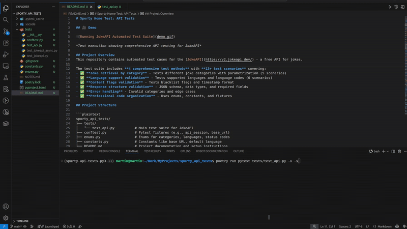

# Playwright with Python API testing DEMO 

## 🎥 Demo



*Test execution showing comprehensive API testing for JokeAPI*

## Project Overview
This repository contains automated test cases for the [JokeAPI](https://v2.jokeapi.dev/) - a free API for jokes.

The test suite includes **4 comprehensive test methods** with **13 test scenarios** covering:
- ✅ **Joke retrieval by category** - Tests different joke categories with parametrization (5 scenarios)
- ✅ **Language support validation** - Tests supported languages and language codes (6 scenarios) 
- ✅ **Content flags validation** - Tests blacklist flags and timestamp format
- ✅ **Response structure validation** - JSON schema, data types, and required fields
- ✅ **Error handling** - Invalid categories and edge cases
- ✅ **Professional code organization** - Uses enums, constants, and fixtures

## Project Structure

```plaintext
sporty_api_tests/
├── tests/
│   ├── test_api.py          # Main test suite for JokeAPI
│   └── conftest.py              # Pytest fixtures
├── enums.py                 # Enums for categories, languages, status codes
├── constants.py             # Constants like base URL, default language
├── README.md                # Project documentation and setup instructions
├── poetry.lock              # Poetry lock file
└── pyproject.toml           # Poetry configuration and dependencies
```

## Setup Instructions

### Prerequisites
To be able to run test, ensure that you have the following:

- git installed on your system.
- Python 3.11.4 or newer: Make sure you have Python installed on your system, recommended to use Pyenv for managing Python versions.
- Poetry: Use Poetry for packaging and dependency management. Refer to the Poetry documentation for installation instructions. Link -> `https://python-poetry.org/`

### Installation

1. Clone the repository and navigate to the project directory:
```bash
git clone <repository-url>
cd sporty_api_tests
```

2. Install dependencies:
```bash
poetry install
```

3. Activate the virtual environment (optional):
```bash
poetry env activate
source $(poetry env info --path)/bin/activate
```

## Running the Tests

### Run all tests:
```bash
poetry run pytest tests/test_api.py -v -s
```

### Run specific test class:
```bash
poetry run pytest tests/test_api.py::TestJokeAPI -v -s
```

### Run specific test method:
```bash
poetry run pytest tests/test_api.py::TestJokeAPI::test_get_joke_by_category -v -s
```

## Test Cases Summary

| Test # | Test Method | Endpoint | Parameters | Description | Validation Methods | Why These Validations |
|---|---|---|---|---|---|---|
| **1** | `test_get_joke_by_category` | `/joke/{category}` | **5 scenarios:** `Any`, `Programming`, `Dark`, `Misc`, `NonExisting` | Tests joke retrieval across different categories including invalid ones | • HTTP status validation (200/400)<br>• URL construction verification<br>• JSON structure validation (`error`, `type`)<br>• Data type validation (boolean, string)<br>• Content validation (joke fields)<br>• Error handling for invalid categories | **HTTP Status**: Ensures API responds correctly for valid/invalid requests<br>**JSON Structure**: Confirms API contract compliance<br>**Data Types**: Prevents type-related bugs in client code<br>**Content Validation**: Ensures meaningful data is returned<br>**Error Handling**: Validates graceful failure for edge cases |
| **2** | `test_get_languages` | `/languages` | None | Validates all supported languages and system languages | • HTTP 200 status validation<br>• Response structure validation<br>• Default language verification<br>• Joke languages list validation<br>• System languages list validation<br>• Enum-based expected values check | **Structure Validation**: Ensures API provides complete language data<br>**Enum Comparison**: Type-safe validation against expected values<br>**List Validation**: Confirms arrays contain expected language codes<br>**Default Language**: Verifies API configuration consistency |
| **3** | `test_get_language_code` | `/langcode/{language}` | **6 scenarios:** English, German, Spanish, French, Portuguese, Czech | Tests language name to ISO code conversion | • HTTP 200 status validation<br>• Error field validation (false)<br>• Code field presence validation<br>• Expected code matching | **Status Validation**: Confirms successful language lookup<br>**Error Field**: Ensures no API errors occurred<br>**Code Matching**: Validates correct ISO code mapping<br>**Parametrization**: Tests multiple language mappings efficiently |
| **4** | `test_get_flags` | `/flags` | None | Validates content blacklist flags and timestamp format | • HTTP 200 status validation<br>• Response structure validation (`flags`, `timestamp`)<br>• Data type validation (list, integer)<br>• Timestamp length validation (13 chars)<br>• Content flags presence validation<br>• Individual flag type validation (string) | **Structure Validation**: Ensures flags endpoint provides complete data<br>**Timestamp Validation**: Confirms UNIX timestamp format (13-digit)<br>**Content Flags**: Validates all expected moderation flags exist<br>**Type Safety**: Ensures consistent data types for reliable parsing |

### **Total Test Coverage:**
- **Test Methods**: 4 comprehensive test functions
- **Test Scenarios**: 13 individual test executions (5 + 1 + 6 + 1)
- **API Endpoints**: 4 different JokeAPI endpoints tested
- **Categories Tested**: Any, Programming, Dark, Misc, NonExisting (invalid)
- **Languages Tested**: English, German, Spanish, French, Portuguese, Czech 
- **Validation Types**: 8 distinct validation methods applied
- **Edge Cases**: Invalid categories, error responses, data type mismatches

## Validation Methods Explained

### 1. **HTTP Status Code Validation**
```python
assert response.status == HttpStatusCodes.HTTP_OK.value
assert response.status == expected_status.value
```
- **Why**: Confirms API responds with correct status codes (200 for success, 400 for bad requests)
- **Used in**: All test methods
- **Benefits**: Catches network issues, invalid requests, and server errors early

### 2. **JSON Structure and Schema Validation**
```python
assert "error" in data, "Missing 'error' field"
assert "jokeLanguages" in data
assert "flags" in data, "Missing 'flags' field"
```
- **Why**: Ensures API response follows expected contract and contains required fields
- **Used in**: All test methods  
- **Benefits**: Prevents integration issues when API schema changes unexpectedly

### 3. **Data Type Validation**
```python
assert isinstance(data["error"], bool), "'error' should be boolean"
assert isinstance(data["flags"], list), "'flags' should be a list/array"
assert isinstance(data["timestamp"], int), "Timestamp should be an integer"
```
- **Why**: Validates response fields have correct data types for reliable parsing
- **Used in**: `test_get_joke_by_category`, `test_get_languages`, `test_get_flags`
- **Benefits**: Prevents runtime errors in client applications

### 4. **Content Validation and Business Logic**
```python
assert data["type"] in [JokeTypes.SINGLE.value, JokeTypes.TWOPART.value]
assert data["defaultLanguage"] == DEFAULT_LANGUAGE
assert expected_flag in data["flags"], f"Expected flag '{expected_flag}' not found"
```
- **Why**: Ensures API returns meaningful, valid business data
- **Used in**: All test methods
- **Benefits**: Validates API business rules and data integrity

### 5. **Enum-Based Validation**
```python
expected_joke_languages = [lang.value for lang in JokeLanguages]
assert set(data["jokeLanguages"]) == set(expected_joke_languages)
```
- **Why**: Type-safe validation against predefined expected values
- **Used in**: `test_get_languages`, `test_get_joke_by_category`
- **Benefits**: Maintainable validation that's easy to update when API changes

### 6. **Timestamp Format Validation**
```python
timestamp_str = str(data["timestamp"])
assert len(timestamp_str) == TIMESTAMP_LENGTH, f"Timestamp should be {TIMESTAMP_LENGTH} characters"
```
- **Why**: Ensures UNIX timestamp format consistency (13-digit millisecond precision)
- **Used in**: `test_get_flags`
- **Benefits**: Validates time-based data for accurate client-side processing

### 7. **URL Construction Validation**
```python
assert response.url == f"{JOKE_API_URL}joke/{category.value}"
```
- **Why**: Verifies correct API endpoint construction and routing
- **Used in**: `test_get_joke_by_category`
- **Benefits**: Ensures API calls target the intended endpoints

### 8. **Error Handling and Edge Case Validation**
```python
if expected_status == HttpStatusCodes.HTTP_BAD_REQUEST:
    assert data["error"] is True, "Expected error for invalid category"
    assert "message" in data, "Missing error message"
```
- **Why**: Validates API gracefully handles invalid inputs with proper error responses
- **Used in**: `test_get_joke_by_category` (NonExisting category)
- **Benefits**: Ensures robust error handling and meaningful error messages for debugging

## API Endpoints Tested

**Base URL**: `https://v2.jokeapi.dev/`

### **1. Joke Retrieval - `/joke/{category}`**
**Tested Categories**: `Any`, `Programming`, `Dark`, `Misc`, `NonExisting` (invalid)

**Single Joke Response**:
```json
{
  "error": false,
  "type": "single",
  "joke": "Why do Java developers wear glasses? Because they can't C#",
  "flags": { "nsfw": false, "religious": false, "political": false, "racist": false, "sexist": false, "explicit": false },
  "id": 28,
  "safe": true,
  "lang": "en"
}
```

**Two-part Joke Response**:
```json
{
  "error": false,
  "type": "twopart", 
  "setup": "Why did the programmer quit his job?",
  "delivery": "Because he didn't get arrays.",
  "flags": { "nsfw": false, "religious": false, "political": false, "racist": false, "sexist": false, "explicit": false },
  "id": 48,
  "safe": true,
  "lang": "en"
}
```

### **2. Language Support - `/languages`**
**Response Structure**:
```json
{
  "error": false,
  "defaultLanguage": "en",
  "jokeLanguages": ["cs", "de", "en", "es", "fr", "pt"],
  "systemLanguages": ["cs", "de", "en", "it", "ru"],
  "possibleLanguages": ["cs", "de", "en", "es", "fr", "pt"]
}
```

### **3. Language Code Lookup - `/langcode/{language}`**
**Tested Languages**: English, German, Spanish, French, Portuguese, Czech

**Response Format**:
```json
{
  "error": false,
  "code": "en"
}
```

### **4. Content Flags - `/flags`**
**Response Structure**:
```json
{
  "error": false,
  "flags": ["nsfw", "religious", "political", "racist", "sexist", "explicit"],
  "timestamp": 1699027200000
}
```

## AI Assistance
This project uses GitHub Copilot to assist in code generation and suggestions. Copilot helps speed up development by providing context-aware code completions and suggestions. Project used GPT-4.1 model.
